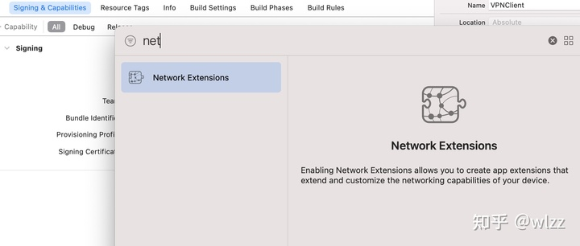
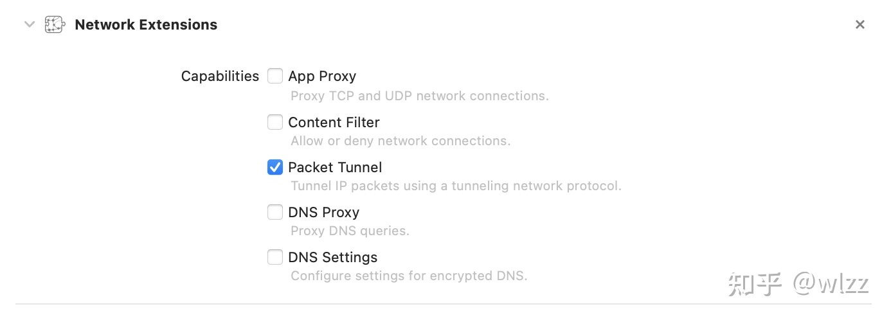
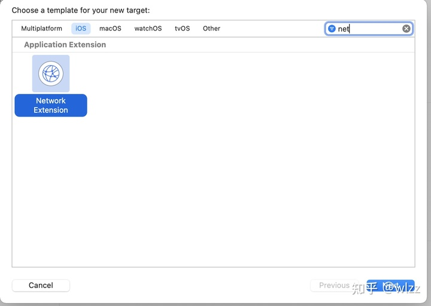
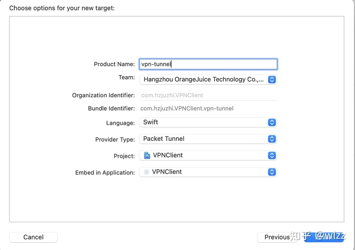
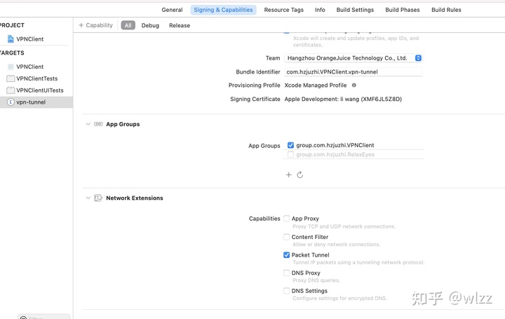
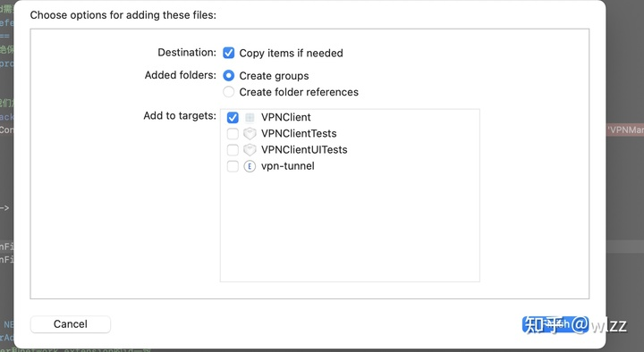
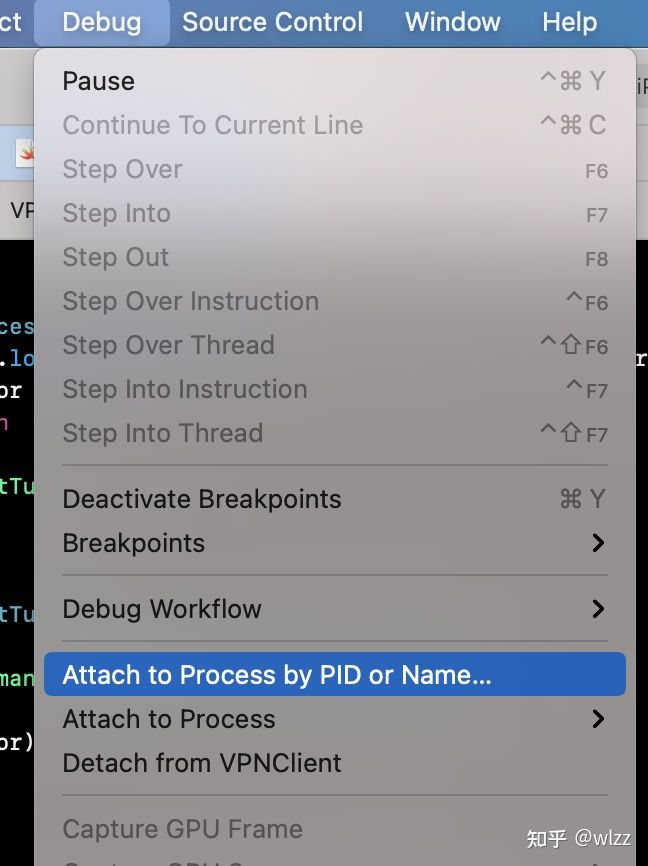
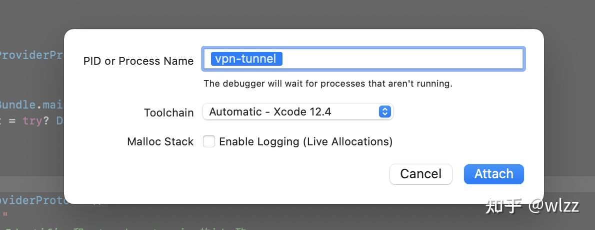
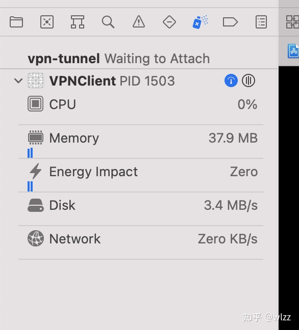
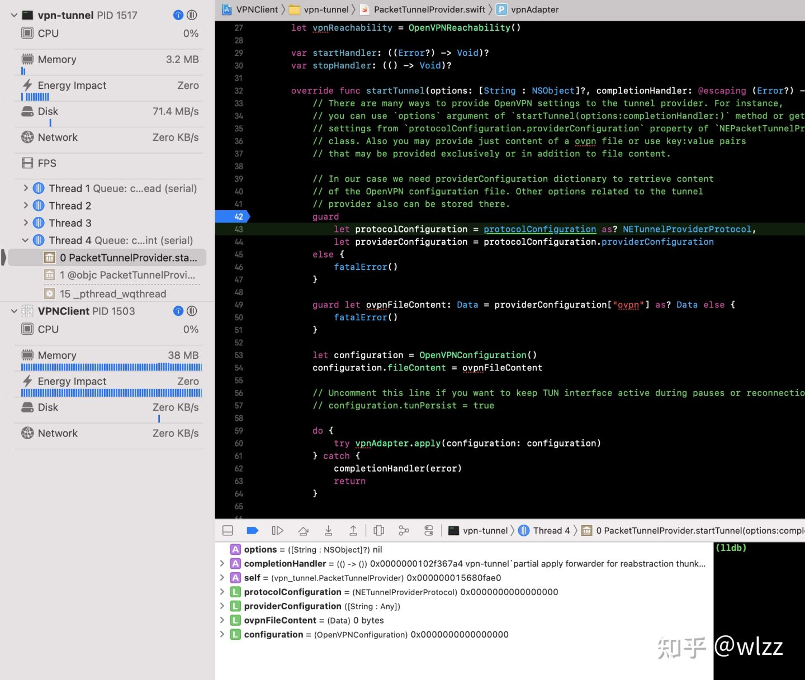

# iOS游戏加速器开发指南

### 1. 基本原理
通过连接对应的代理服务器以降低延迟,获得更好的游戏体验。

### 2.准备工作
1.一台服务器

2.iOS真机设备(NetworkExtension)只支持真机调试

3.付费开发者账号

### 3. 本文环境
服务器系统为
>centos

协议选用
>OpenVPN

### 4. 服务器配置
参考[此链接](http://link.zhihu.com/?target=https%3A//github.com/angristan/openvpn-install)我们可以根据readme非常方便的在服务器上安装openvpn

>如果你的网络不行

1. 手动拷贝链接中的 `openvpn-install.sh`
脚本到服务器上

2. 调整权限 
		
		$ chmod +x openvpn-install.sh
3. 运行脚本

		$ sudo ./openvpn-install.sh

运行成功后你会看到以下信息:

		Welcome to the OpenVPN installer!
		The git repository is available at: https://github.com/angristan/openvpn-install
		
		I need to ask you a few questions before starting the setup.
		You can leave the default options and just press enter if you are ok with them.
		
		I need to know the IPv4 address of the network interface you want OpenVPN listening to.
		Unless your server is behind NAT, it should be your public IPv4 address.
		IP address: xxxxxxx
第一次运行它时，你需要回答几个问题来设置你的VPN服务器。如果没有什么特殊的需求，可以一直确认。最后，安装成功

	Client vpnclient added.
	
	The configuration file has been written to /home/parallels/vpnclient.ovpn.
	Download the .ovpn file and import it in your OpenVPN client

> 安装完成后你能看到以下信息,注意保存`vpnclient.ovpn`
文件，后续我们连接此服务器的时候会用到。
	.
### 5. iOS工程配置

1. 在 `Signing & Capabilities`中添加`Network Extensions`
	
	
	
3. 勾选 `Packet Tunnel`
	
	

3. Xcode中选择`File -> New -> Target`添加`Network Extension`
	
	
	

4. 并将`Network Extension` 命名为`vpn-tunnel`

	

6. 同时需要在`vpn-tunnel`这个target的`Signing & Capabilities`中也添加` Network extension`并勾选
`Packet Tunnel`

	

7. 然后将服务器生成的 `vpnclient.ovpn`文件拷贝到工程中

	

8. 我们使用的是`openvpn`协议,如果全部自己实现非常繁琐,这里我们导入已经写好的[OpenVPNAdapter](https://github.com/ss-abramchuk/OpenVPNAdapter)这个第三方库协助我们快速完成连接
需要注意的是,这个库是提供给`vpn-tunnel`这个target使用的，不要导入到主工程中
​

### 6.代码部分
1. 我们创建`VPNManager`类管理我们的连接
		
		import NetworkExtension
		
		class VPNManager {
		    
		    static let shared = VPNManager()
		    
		    var manager: NETunnelProviderManager?
		        
		    private init(){ }
		}
2. 首先我们需要初始化`manager` 首先加载，如果没有对应的`manager`我们就新创建一个

		    //加载已保存的NETunnelProvider configurations
		    func loadManager() {
		        NETunnelProviderManager.loadAllFromPreferences { (managers, error) in
		            guard error == nil else {
		                return
		            }
		            if let manager = managers?.first {
		                self.manager = manager
		            } else {
		                //新建
		                self.manager = NETunnelProviderManager()
		                self.manager?.localizedDescription = "myVPN"
		            }
		        }
		    }
    
3. 有了`manager`我们来看一下`connect`方法 。非常简单，等待`manager`初始化完成后我们调用`loadPreferences`加载vpn配置，加载完成后会自动调用连接县对应的方法

		    func connect() {
		        guard self.manager != nil else {
		            print("未初始化完成")
		            return
		        }
		        self.loadPreferences()
		    }
    
4. 在`loadPreferences`中我们首先读取是否有先前创建好的配置信息。如果没有配置信息，我们需要新建配置。 然后将`isEnabled`设置为`true`进行保存。

	> 第一次写这部分代码的时候我在保存配置信息后直接进行连接, 但是这样操作会造成连接失败，查询后发现需要重新加载一下配置再进行连接，一切就正常了。 所以保存后我们需要调用

    //加载当前xxx配置
    func loadPreferences() {
        guard let manager = self.manager else {
            return
        }
        
        self.manager?.loadFromPreferences { (error) in
            guard error == nil else {
                return
            }
            
            // 如果没有对应的配置,我们需要新建配置
            if manager.protocolConfiguration == nil {
                manager.protocolConfiguration = self.newConfiguration()
            }
            
            // 设置完isEnabled需要保存配置,启动当前配置
            manager.isEnabled = true
            manager.saveToPreferences { (error) in
                guard error == nil else {
                    // 用户拒绝保存等情况,清空配置
                    manager.protocolConfiguration = nil
                    return
                }
                // 保存完成后我们需要重新加载配置,进行连接,
                //https://stackoverflow.com/questions/47550706/error-domain-nevpnerrordomain-code-1-null-while-connecting-vpn-server
                self.loadPreferencesAndStartTunnel()
            }
            
        }
    	}
    
5. 最终，加载配置，并进行连接。

		  func loadPreferencesAndStartTunnel()  {
		        self.manager?.loadFromPreferences(completionHandler: { (error) in
		            guard error == nil else {
		                return
		            }
		            self.startTunnel()
		        })
		    }
		
		    private func startTunnel() {
		        do {
		            try self.manager?.connection.startVPNTunnel()
		        } catch  {
		            print(error)
		        }
		    }

    
6. vpn配置部分,首先读取工程中的`ovpn`文件，然后我们在这里关联了`vpn-tunnel`这个`target `

		    func newConfiguration() -> NETunnelProviderProtocol {
		        //加载ovpn文件
		        guard
		            let configurationFileURL = Bundle.main.url(forResource: "vpnclient", withExtension: "ovpn"),
		            let configurationFileContent = try? Data(contentsOf: configurationFileURL)
		        else {
		            fatalError()
		        }
		        
		        let tunnelProtocol = NETunnelProviderProtocol()
		        tunnelProtocol.serverAddress = ""
		        //指定NetworkExtension 确保bundleIdentifier和network extension target的id一致
		        tunnelProtocol.providerBundleIdentifier = Bundle.main.bundleIdentifier!.appending(".vpn-tunnel")
		        tunnelProtocol.providerConfiguration = ["ovpn": configurationFileContent]
		        
		        return tunnelProtocol
		    }
		    

7. `vpn-tunnel` 也就是`network extension`部分调整`PacketTunnelProvider`中的代码，参照项目中的实现
		
		import NetworkExtension
		import UIKit
		import OpenVPNAdapter
		
		
		// Extend NEPacketTunnelFlow to adopt OpenVPNAdapterPacketFlow protocol so that
		// `self.packetFlow` could be sent to `completionHandler` callback of OpenVPNAdapterDelegate
		// method openVPNAdapter(openVPNAdapter:configureTunnelWithNetworkSettings:completionHandler).
		extension NEPacketTunnelFlow: OpenVPNAdapterPacketFlow {}
		
		class PacketTunnelProvider: NEPacketTunnelProvider {
		.........
		}
    
    
    
    
    
> 到这里关键部分的代码就已经完成了，你可以调用connect方法进行连接测试，记得把
ovpn
替换成自己的然后进行测试。

### 7. Debug
1. 调试 `Extension`比较麻烦， 我们需要在`Debug / Attach to Process by PID or Name`输入`Extension`名字。 对于此工程我们输入`vpn-tunnel`

	
	

2. 我们可以看到`vpn-tunnel`正在等待连接，等到`extension`启动的时候。xcode会自动帮我们建立连接，这时候我们就可以正常调试了。

	

3. 我们可以在`startTunnel`打断点进行调试是否能正常调试

	

### x.参考链接

1. [What's New in Network Extension and VPN
](https://developer.apple.com/videos/play/wwdc2015/717)
​
2. [VPN, Part 1: VPN Profiles](https://kean.blog/post/vpn-configuration-manager)